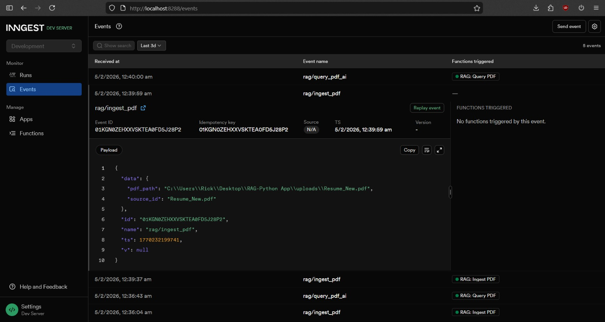
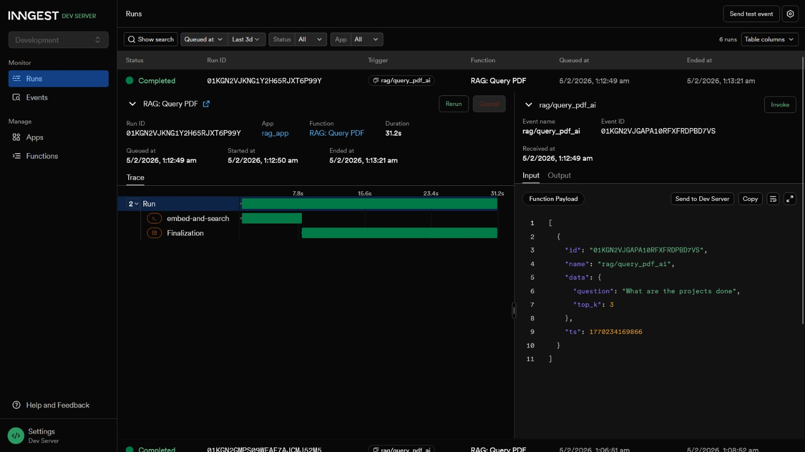
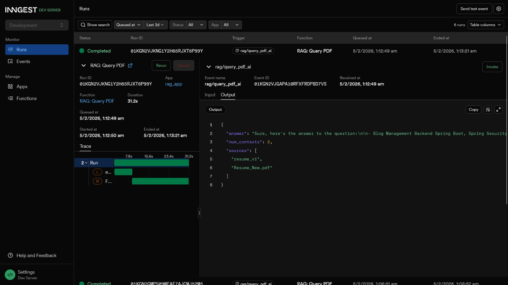
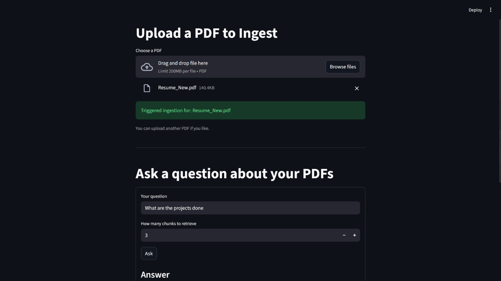
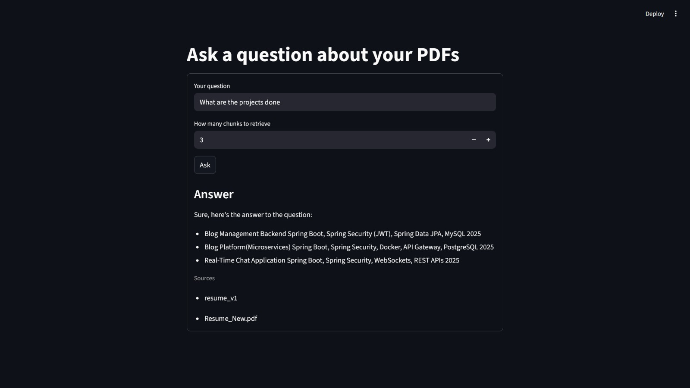

# Event-Driven RAG System

A production-oriented **Retrieval-Augmented Generation (RAG)** system built with an event-driven architecture using **Inngest**, **Qdrant**, and a **local LLM (Ollama)**.

This project demonstrates how to design and orchestrate a real-world GenAI pipeline rather than a simple demo.

---

##  What This Project Does

- Ingests PDF documents asynchronously
- Chunks and embeds content using Hugging Face models
- Stores embeddings in Qdrant (vector database)
- Performs semantic search at query time
- Generates grounded answers using a **local LLM**
- Orchestrates workflows using **Inngest events**
- Provides an optional Streamlit UI for interaction

---

##  Architecture Overview

```text
PDF
↓
Inngest Event (rag/ingest_pdf)
↓
Chunking + Embeddings
↓
Qdrant Vector Store
↓
Inngest Event (rag/query_pdf_ai)
↓
Semantic Search
↓
Local LLM (Ollama)
↓
Answer
```

---

##  Architecture & UI Screenshots

### 1. Inngest – PDF Ingest Event


---

### 2. Inngest – Query Event Execution


---

### 3. RAG Query Result (Semantic Search + LLM)


---

### 4. Streamlit UI – Upload & Query


---

### 5. Streamlit UI – Answer Output



---

##  Tech Stack

- **FastAPI** – backend API
- **Inngest** – event-driven orchestration
- **Qdrant** – vector database
- **Hugging Face** – text embeddings
- **Ollama** – local LLM inference
- **Streamlit** – optional frontend UI
- **Docker** – Qdrant containerization

---

##  Running the Project (Local)

### 1. Start Qdrant
```bash
docker run -p 6333:6333 -p 6334:6334 qdrant/qdrant
```
### 2. Start the Backend
```bash
python -m uvicorn main:app --reload
```
### 3. Start Inngest Dev Server
```bash
npx inngest-cli@latest dev -u http://127.0.0.1:8000/api/inngest
```
### 4. Start Streamlit
```bash
streamlit run streamlit_app.py
```

---

##  Ingest a PDF

Send an event via the Inngest UI (http://127.0.0.1:8288):
```bash
{
  "name": "rag/ingest_pdf",
  "data": {
    "pdf_path": "path/to/document.pdf",
    "source_id": "doc_v1"
  }
}
```

## Query the Document
```bash
{
  "name": "rag/query_pdf_ai",
  "data": {
    "question": "What skills are mentioned in the document?",
    "top_k": 5
  }
}
```

---

## Design Decisions

- Event-driven ingestion to support async workflows
- Local LLM (Ollama) to avoid paid APIs and show cost awareness
- Qdrant for production-grade vector search
- Inngest for observability, retries, and orchestration
- Docker intentionally limited to infrastructure (Qdrant)

---

## Why This Project

Most RAG projects are simple scripts or demos.
This project focuses on **system design, event orchestration, observability, and real-world constraints**.

---

## Key Highlights

- Fully event-driven RAG pipeline (ingest & query decoupled)
- Async ingestion with retries and observability via Inngest
- Local LLM inference for cost-efficient GenAI systems


